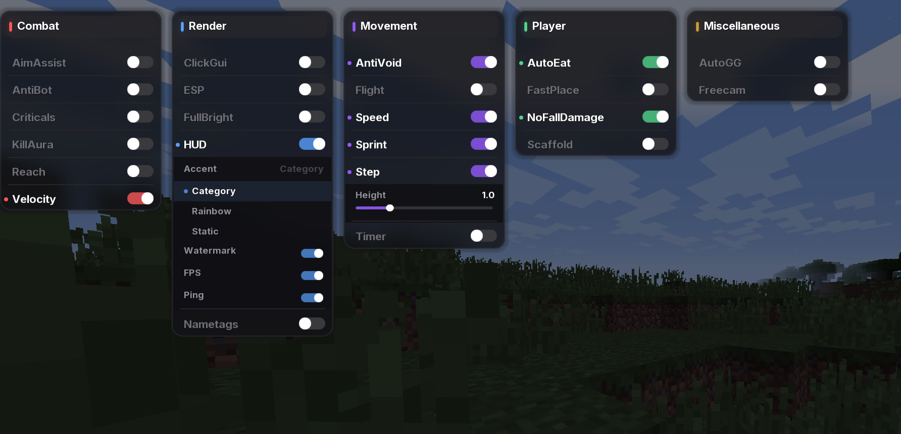

List of changes/additions to be made.

1. [x] Velocity mode "delay" "always-delay" option
- In "delay" mode there should be an option called "always-delay" that will force the "knockback delay" already built into the velocity mode to always be applied when recieving damage. It should not overlap if the "knockback delay" is already being applied.

2. [x] Velocity module: "weapons-only" option
- In the velocity module, there should be an option called "weapons-only" that will only apply the velocity actions when holding a weapon. You can use "weapons-only" from the module "Kill Aura"
S

### Important: "always-delay" should respect "weapons-only" and only apply the knockback delay if the player is holding a weapon.
Eg. "Im holding a fireball, I perform a fireball jump, Velocity should NOT work because im not holding a weapon. Regardless of the fact that "always-delay" is enabled, the knockback delay should NOT be applied because im not holding a weapon.

3. [x] KillAura option: wolf
- As it implies: include wolfs to killaura targets just like golem or silverfish. This should be an option that can be toggled on or off just like the other options in the killaura module. It should be called "wolf" and when enabled, it should target wolfs just like it does with golems and silverfish.

4. [x] Lag Range module: "backwards-dmg-ignore" option
- In the lag range module, there should be an option called "backwards-dmg-ignore" that will stop "Lag ranging" when damaged and recieving backwards knockback. This should be an option that can be toggled on or off just like the other options in the lag range module. When enabled, it should stop lag ranging when the player is damaged and recieves backwards knockback. This should not affect forwards knockback, only backwards knockback.

5. [x] Config revamp/fixing
- The config system should be revamped to save every single option, configuration, module state and values when saving a config. This should be done to prevent any loss of data when saving a config and to make sure that all options are saved correctly. This should also include fixing any bugs related to the config system that may cause issues when saving or loading configs.

6. [x] Finish rebranding to Myaulex
- The rebranding to Myaulex should be finished by changing all instances of "Myau" to "Myaulex" in any string that is visible

7. [x] Version change: V1, pretty simple, just change the version to V1 to mark the first release of Myaulex. This should be done after all the other changes have been made and tested to ensure that everything is working correctly before marking it as V1.

8. [x] RenderFixes should be integrated into Myaulex itself instead of being a module. This is because RenderFixes is a core part of the client and should be integrated into the client itself rather than being a separate module. This will also allow for better performance and stability as it will be integrated into the client rather than being a separate module that may cause issues. The RenderFixes module should be removed and all of its features should be integrated into the main client codebase.

9. [x] Module changes.
- Remove Backtrack, HitSelect, LightningTracker, AutoAnduril, AntiObbyTrap from the client. Remove both the modules themselves and also remove them from the ClickGUI.

10. [x] Transition to modern fonts:
- Transition the client to use modern fonts on the HUD, ClickGUI and other places where text is displayed by this client, You should use OpenMyau-plus's rendering, utils, HUD system and ClickGUI system as a reference for this. This will give the client a more modern and polished look and feel.
- The fonts should be reflected on places like the Array List from "HUD" module
- The "HUD" module should have an option to change the font from the client by the default to built-in fonts. [font](OpenMyau-Plus/src/main/resources/assets/myau/font) Copy fonts from OpenMyau-plus directory and include them in Myaulex's resources and make them available in the "HUD" module options. This will allow users to customize the font used in the HUD and give them more options to choose from. The default font should be a modern font that fits well with the overall aesthetic of the client.

11. [x] Floating island module
- Taken from OpenMyau-Plus's codebase, the floating island module should be added to Myaulex as a new module on the Visual category. This module should allow the player to render a floating island that shows the Name, version of the client, connected server, latency in miliseconds and the current time. This module should be customizable with options to change the position, size, colors and other aspects of the floating island. This will give users a nice visual element to display important information about the client and their connection. The floating island should be designed to fit well with the overall aesthetic of the client and should be visually appealing.

12. [x] FKDR Tracker + Session stats module
- Taken from OpenMyau-Plus's codebase as the base: This module displays the kill count and death count of the player in the current session, as well as the FKDR (Kill/Death ratio) of the player. This module should be added to Myaulex as a new module on the visual category. This module should be customizable with options to change the position, size, colors and other aspects of the display. This will give users a nice visual element to track their performance in the current session and see their kill/death ratio at a glance. The design of this module should fit well with the overall aesthetic of the client and should be visually appealing.
- FKDR and Kill tracking should be done by listening to chat messages and parsing them to extract the relevant information, this is done by using regex patterns to match "A ... M" Where A is a player (any player) and M is the current user, Myaulex already knows the player's username. (NickHider module is able to know what player is the user) by detecting if the player is first of last in the message we can identify if it was a kill or a death, and if the end of the message says "FINAL KILL", "FINAL KILL!", "ABATE FINAL" or "ABATE FINAL!" we can register it as "Final Kill" instead of a regular kill
- Final Kills should be registered in "lifetime" while normal Kills should be registered in "session" and the same applies to deaths, if the player dies and the message matches the pattern "M was killed by A" or "M was slain by A" or "M was shot by A" or "M was blown up by A" or "M was fireballed by A" or "M was killed by A using magic" then we can register a death for the player. This will allow us to track kills and deaths accurately and display them in the FKDR Tracker module.
- This tracking feature should be separated per server, meaning that if the player is on Hypixel, it should track kills and deaths separately from if the player is on another server. This will allow users to see their performance on different servers and track their stats more accurately. The tracking should be done in a way that does not cause any performance issues or lag, and should be optimized for efficiency.
- FKDR tracking should be saved to a separate file for each server in the /config/Myaulex/stats/ directory.

13. [x] Toggle notifications
- OpenMyau-plus already has a toggle notification system in place, this system should be integrated into Myaulex to provide users with notifications when they toggle modules on or off. This will give users feedback when they toggle modules on a HUD element instead of a chat message, this will make it more visually appealing and less intrusive than chat messages. The toggle notifications should be customizable with options to change the position, size, colors and other aspects of the notifications. The design of the toggle notifications should fit well with the overall aesthetic of the client and should be visually appealing. This will enhance the user experience by providing clear feedback when toggling modules and will make it easier for users to see when they have successfully toggled a module on or off.
- Include smooth animations for the toggle notifications to make them more visually appealing and less jarring when they appear and disappear. This will enhance the overall user experience and make the notifications feel more polished and integrated into the client. The animations should be smooth and not cause any performance issues or lag, and should be optimized for efficiency. The design of the animations should fit well with the overall aesthetic of the client and should be visually appealing, use OpenMyau-plus's toggle notification animations as a reference for this and copy it over if possible.

14. [x] Register AutoRegister module on ClickGUI
15. [x] New ClickGUI design: 
- The ClickGUI should be redesigned to have a more modern and polished look and feel. The new design should include a new layout, new colors, new fonts and new icons for the modules. The design should be visually appealing and should fit well with the overall aesthetic of the client.
- Reference image on 
- Include an option on .clickgui command called "clickgui-style" to switch between the new ClickGUI design and the old ClickGUI design.

16. [x] ServerHider module: It will scan strings on scoreboard, chat messages, TAB,and anywhere else it can to detect the IP Address of the server and it will hide it by replacing the IP address with "Hidden IP" or a different text string customizable in the module's options (Take NickHider module as reference, its already on Myaulex). This will help to protect the privacy of the user by hiding the IP address of the server they are playing on, and will also prevent other players from easily seeing what server they are on. The ServerHider module should be customizable with options to change the text used to replace the IP address, as well as options to enable or disable the hiding of IP addresses in different places (scoreboard, chat messages, TAB, etc). The design of the ServerHider module should fit well with the overall aesthetic of the client and should be visually appealing.

17. [x] Fade-in and fade-out animations for the Array List when enabling or disabling a module, aswell as other HUD elements such as block counter for scaffold and blink timer. This will make the HUD elements feel more polished and visually appealing when they appear and disappear, and will enhance the overall user experience. The animations should be smooth and not cause any performance issues or lag, and should be optimized for efficiency. The design of the animations should fit well with the overall aesthetic of the client and should be visually appealing, use OpenMyau-plus's fade-in and fade-out animations as a reference for this and copy it over if possible.
